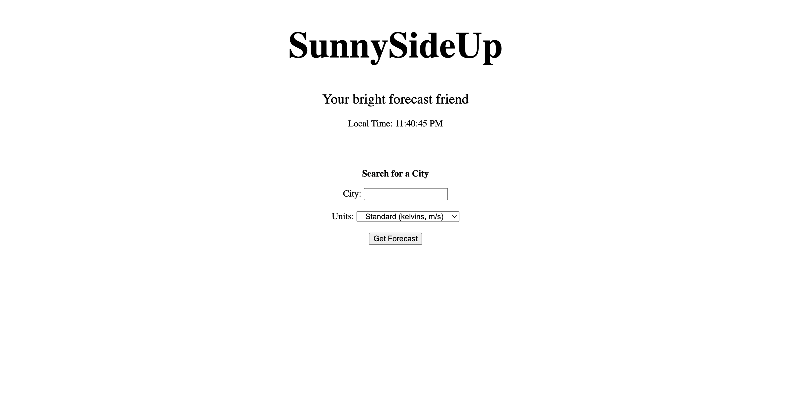
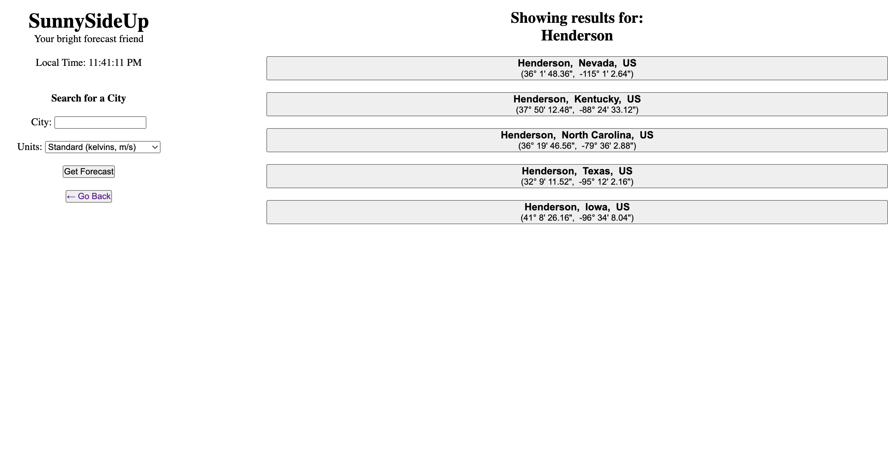
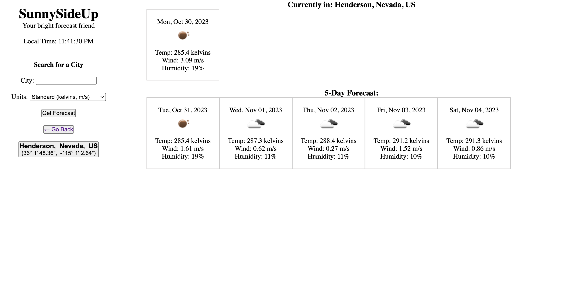

# Project Name

## Description

[Write me a brief description section and usage section for the following code:

<insert code>]

This code generates a random password based on user input for length and character types.

It first defines some global variables to reference the HTML elements for the "Generate" and rer"Re-roll" buttons, as well as variables to store the password length and character types.

The getLength() function prompts the user for the password length and validates it is between 8 and 128 characters. The getCharTypes() function prompts the user to select character types for the password and validates at least one is chosen.

The generatePassword() function contains the logic to randomly generate a password string using the global length and types variables. It defines character pools for each type, gets a random character from the appropriate pool based on the selected types, and concatenates them to build the password.

The writePassword() function calls the prompt functions, generates the password, and updates the #password element with the generated password.

The rewritePassword() function regenerates a new password using the same password criteria, length and character types, without reprompting the user. It is called when the "Re-roll" button is clicked.

Event listeners are added to call the functions when the buttons are clicked.

Hopefully, this code will be put to good use with all the useless accounts that I have...

## Usage

[Write me a brief description section and usage section for the following code:

<insert code>]

To use the random password generator:

1. Load the page containing the HTML input and buttons.
2. Click the "Generate" button.
3. When prompted, enter the desired password length (8-128 characters) and select the types of characters to include.
4. A random password matching the selected criteria will be generated and populated into the password input field.
5. If unhappy with the generated password, click the "Reroll" button to generate a new random password with the same criteria.
6. The password can then be copied from the input field for use.

Some usage notes:

- The prompted criteria will be remembered between generations in the current session. Refreshing the page will reset them.
- At least one character type must be selected when prompted.
- The generator includes lowercase, uppercase, numbers, and special characters.
- Clicking "Re-roll" will generate a new password matching the previous criteria, lenth and character types.

So in summary, generate a custom password, re-roll it, and copy it!

## Screenshots

The following image demonstrates the web application's appearance and functionality:

## Deployment Link

https://jmlouf.github.io/password-generator/

## Credits

This project was created for educational purposes as part of the KU Coding Bootcamp curriculum.

The following resources were utilized:

- KU Coding Bootcamp Spot - Provided project requirements and guidelines.
- W3Schools - General reference for HTML, CSS and JavaScript.
- Tech with Tim - YouTube channel with web development tutorials.
- freeCodeCamp.org - Reference for JavaScript concepts and best practices.
- https://owasp.org/www-community/password-special-characters – A list of password special characters.

## License

Please refer to the LICENSE in the repository.